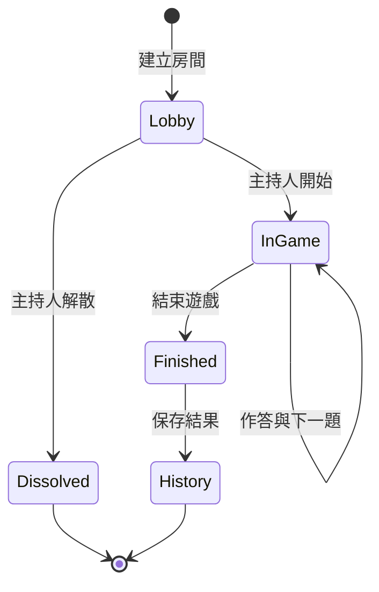
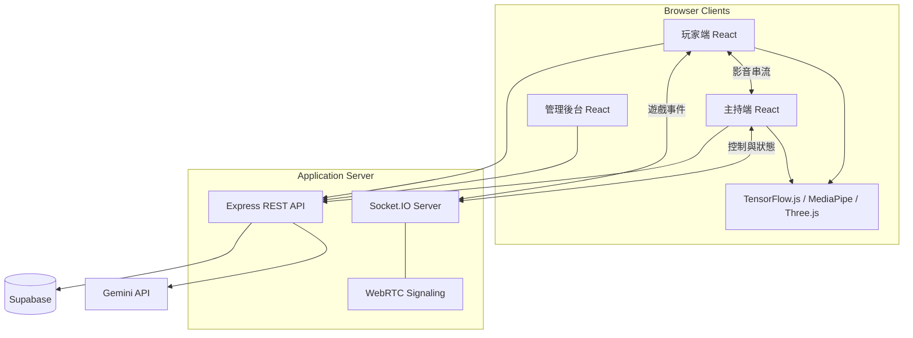

# AR Vision Link

<div >

**結合即時多人測驗、AR 互動、WebRTC 視訊與人臉辨識的線上學習平台**

[](https://react.dev/)
[](https://vite.dev/)
[](https://nodejs.org/)
[](https://socket.io/)
[](https://supabase.com/)
[](https://reactrouter.com/)
[](https://expressjs.com/)
[](https://webrtc.org/)
[](https://www.tensorflow.org/js)
[](https://ai.google.dev/edge/mediapipe/solutions/guide)
[](https://threejs.org/)
[](https://ai.google.dev/)
[](https://pages.github.com/)


</div>

<hr />

**專案網址：** [https://b1229049.github.io/ar-vision-link/](https://b1229049.github.io/ar-vision-link/)

---

# 目錄

- [專案介紹](#專案介紹)
- [功能特色](#功能特色)
- [實機畫面](#實機畫面)
- [系統使用流程](#系統使用流程)
- [技術架構](#技術架構)
- [即時通訊設計](#即時通訊設計)
- [人臉辨識與 AR](#人臉辨識與-ar)
- [計分機制](#計分機制)
- [專案結構](#專案結構)
- [資料庫設計](資料庫設計)
- [主要頁面](#主要頁面)
- [文件](#相關文件)
- [影片](#report-video-demo)

---

# 專案介紹

AR Vision Link 是一套以瀏覽器為核心的互動式測驗平台。系統將傳統選擇題遊戲與攝影機、即時視訊、人臉辨識及 AR 技術整合，讓主持人與玩家能在同一場線上活動中即時互動。

主持人可以建立或管理題庫、開設遊戲房間、控制題目進度並查看玩家影像；玩家則可以使用房號加入，選擇一般答題或 AR 手勢模式，並即時取得分數與排名。

平台也提供 AI 出題、虛擬替身、造型商城、QR Code 金幣獎勵、AR 自拍、測驗歷史與管理後台等延伸功能。

### 適用情境

- 課堂即時測驗與複習活動
- 校園成果展示或互動展覽
- 多人競賽與團體活動
- AR、人臉辨識及 WebRTC 技術展示
- 遠距教學中的互動回饋

---

# 功能特色

### 即時多人測驗

- 使用六碼房號建立與加入房間
- Lobby 即時顯示已加入玩家
- 主持人控制開始、換題、結束及解散房間
- 題目、倒數、作答結果與排行榜即時同步
- 玩家離線與短時間重新連線處理
- 支援一般模式、AR 模式及加入時選擇模式

### Quiz Center

- 建立、瀏覽、編輯與刪除題庫
- 每題支援四個選項、正確答案與作答時間
- 顯示已建立測驗及主持紀錄
- 查看玩家或主持人的歷史場次
- 顯示單場題目、答案與得分明細

### AI 題目生成

- 輸入文字內容產生四選一題目
- 上傳 PDF 並將內容整理為題庫
- 可設定產生題數與難度
- 自動檢查題目、選項與答案格式
- 產生後仍可人工修改再建立題庫

### WebRTC 玩家影像

- 玩家攝影機串流至主持人控制台
- Socket.IO 負責 WebRTC signaling
- 支援 STUN 與 TURN 連線設定
- 主持人可同時查看多位玩家影像
- 玩家斷線時自動清除對應的 Peer Connection

### 人臉辨識

- 註冊時擷取臉部特徵向量
- 透過歐氏距離進行登入比對
- 支援重新註冊臉部資料
- 可在相機畫面辨識多位已註冊使用者
- TensorFlow.js 支援 WebGL、WASM 與 CPU 後端降級

### AR Quiz

- 使用 MediaPipe 追蹤手部關鍵點
- 透過手勢選擇答案
- 在攝影機畫面疊加題目與作答介面
- 即時顯示個人分數與排行榜
- 與一般遊戲模式共用相同房間狀態

### AR 自拍

- 即時追蹤臉部 landmarks 與表情資訊
- 支援眼鏡、動物造型等效果
- 支援 2D Canvas 特效
- 使用 Three.js 載入及呈現 3D 配件
- 可依臉部位置、角度及比例調整特效

### 虛擬替身與換裝

- 所有user均擁有自己的虛擬替身
- 虛擬替身包含髮型、表情、上衣及下身分層組合
- 可透過不同造型打造自己的虛擬替身

### 管理後台

- 查看使用者數量及系統資源概況
- 管理使用者狀態與管理員權限
- 檢視測驗、場次、作答及視覺紀錄
- 編輯或刪除允許管理的資料內容
- 建立並追蹤限時金幣獎勵

---

# 實機畫面

### Quiz Center

題庫建立、題庫管理與歷史紀錄集中在同一個控制中心。

<div align="center">
  
</div>

### 遊戲畫面

玩家作答與主持人控制台即時同步，完整呈現從 Lobby 到即時答題的遊戲流程。

<div align="center">
  
</div>

### AR Quiz

展示手勢辨識、相機背景、答案區域與即時回饋。

<div align="center">
  
</div>

### AR 自拍

可將多種 2D 與 3D 濾鏡整理成一張橫向展示圖。

<div align="center">
  
  
</div>

### 虛擬替身換裝

展示角色預覽、分類選擇與不同完成造型。

<div align="center">
  
</div>

---

# 系統使用流程

### 主持人流程

```text
登入
  ↓
建立或選擇題庫
  ↓
建立遊戲房間並取得房號
  ↓
等待玩家加入 Lobby
  ↓
開始遊戲並控制換題
  ↓
查看即時作答、玩家影像與排行榜
  ↓
結束遊戲並查看歷史紀錄
```

### 玩家流程

```text
人臉登入
  ↓
輸入或掃描房號
  ↓
加入 Lobby 並選擇遊戲模式
  ↓
使用按鈕或 AR 手勢作答
  ↓
查看單題結果與即時排名
  ↓
遊戲結束後查看排行榜
```

### 遊戲狀態



---

# 技術架構



### 技術堆疊

| 層級 | 技術 | 用途 |
| --- | --- | --- |
| 前端 | React 19 | 元件化使用者介面與狀態管理 |
| 路由 | React Router 7 | 公開頁面、保護頁面與巢狀 Quiz Center |
| 建置 | Vite 8 | 前端建置與靜態資源處理 |
| 後端 | Node.js、Express 4 | REST API、遊戲邏輯及檔案上傳 |
| 即時同步 | Socket.IO 4 | 房間、題目、答案與排行榜事件 |
| 視訊 | WebRTC | 玩家攝影機至主持人的影音串流 |
| 雲端服務 | Supabase | 使用者、題庫、場次及歷史資料 |
| AI | Google Gen AI SDK、Gemini | 文字與 PDF 題目生成 |
| 人臉辨識 | face-api、TensorFlow.js | 人臉偵測、特徵擷取與比對 |
| AR 追蹤 | MediaPipe Tasks Vision | 臉部及手部關鍵點追蹤 |
| 3D | Three.js | 3D AR 模型載入與渲染 |
| QR Code | ZXing、qrcode | QR Code 掃描與產生 |

### 前後端職責

- **React 前端**：處理畫面、攝影機權限、AR 推論、作答操作與虛擬角色呈現。
- **Express API**：處理使用者、測驗、遊戲、作答、歷史、商城、獎勵及管理功能。
- **Socket.IO**：維持多人房間狀態並推送所有即時遊戲事件。
- **WebRTC**：負責玩家與主持人之間的影音傳輸。
- **Supabase**：保存跨裝置及跨場次需要持續存在的資料。
- **Gemini**：將文字或 PDF 教材轉換成結構化選擇題。

---

# 即時通訊設計

### 遊戲事件

| 事件 | 方向 | 說明 |
| --- | --- | --- |
| `join-session` | Client → Server | 加入指定遊戲房間 |
| `session-sync` | Server → Client | 傳回房間、題庫與排行榜完整狀態 |
| `player-joined` | Server → Room | 通知新玩家加入 |
| `player-left` | Server → Room | 通知玩家離開 Lobby |
| `game-started` | Server → Room | 遊戲開始 |
| `question-changed` | Server → Room | 切換至下一題 |
| `answer-submitted` | Server → Room | 玩家已完成作答 |
| `player-result-updated` | Server → Room | 推送正確性與得分結果 |
| `leaderboard-updated` | Server → Room | 推送最新排行榜 |
| `game-finished` | Server → Room | 遊戲結束及最終排行 |
| `room-dissolved` | Server → Room | Lobby 已被主持人解散 |

### WebRTC signaling 事件

| 事件 | 用途 |
| --- | --- |
| `webrtc-host-ready` | 主持端通知玩家可建立連線 |
| `webrtc-player-ready` | 玩家端通知主持端已準備完成 |
| `webrtc-offer` | 傳遞 SDP offer |
| `webrtc-answer` | 傳遞 SDP answer |
| `webrtc-ice-candidate` | 交換 ICE candidate |
| `webrtc-user-disconnected` | 清除離線使用者的影音連線 |

---

# 人臉辨識與 AR

### 人臉登入流程

```text
取得攝影機畫面
  ↓
偵測單一人臉與 68 個 landmarks
  ↓
產生臉部 descriptor
  ↓
與已註冊特徵計算歐氏距離
  ↓
選擇距離最小且通過門檻的使用者
```

### 推論後端降級

系統會優先嘗試使用 WebGL。若裝置不支援或初始化失敗，會切換至 WASM，最後再使用 CPU，讓不同裝置仍能使用基本的人臉功能。

```text
WebGL → WASM → CPU
```

### AR 處理方式

- MediaPipe Face Landmarker 提供臉部關鍵點與表情資訊。
- MediaPipe Hand Landmarker 提供手部關鍵點，供 AR Quiz 判斷手勢。
- Canvas 2D 負責繪製眼鏡、皇冠及動物造型等平面特效。
- Three.js 負責載入 GLTF 與自訂幾何模型並對齊臉部位置。
- 特效尺寸與旋轉會依眼距、臉部角度及畫面尺寸動態更新。

---

## 計分機制

每題得分由正確性與剩餘時間共同決定：

```text
答對：1000 + max(剩餘秒數, 0) × 10
答錯：0
總分：同一場次所有題目得分總和
```

作答完成後，伺服器會更新玩家累積分數，並向房間內所有使用者推送個人結果與最新排行榜。

---

# 專案結構

```text
ar-vision-link/
├─ backend/
│  ├─ server.js                  # REST API、遊戲邏輯、Socket.IO、WebRTC signaling
│  ├─ admin-server.js            # 管理後台與獎勵 API
│  └─ package.json               # 後端相依套件與啟動設定
├─ public/
│  ├─ ar-assets/                 # 3D AR 模型、材質與授權資訊
│  ├─ avatar-assets/             # 基本虛擬角色圖層
│  ├─ store/                     # 商城套裝圖層
│  ├─ generated/                 # 產品與角色展示素材
│  └─ tfjs-backend-*.wasm        # TensorFlow.js WASM 執行檔
├── src/
│  ├── assets/                         # 靜態圖片與圖示資源
│  │
│  ├── components/                     # 可重複使用的 React 元件
│  │   ├── AdminRoute.jsx              # 管理員權限路由
│  │   ├── AvatarRenderer.jsx          # 虛擬角色渲染元件
│  │   ├── LobbyProfileModal.jsx       # 大廳玩家資料彈出視窗
│  │   ├── MobileBottomNav.jsx         # 行動版底部導覽列
│  │   ├── Navbar.jsx                  # 網站頂部導覽列
│  │   ├── ProfileImage.jsx            # 使用者頭像顯示元件
│  │   ├── ProtectedRoute.jsx          # 登入權限保護路由
│  │   ├── QuizDashboardLayout.jsx     # 測驗後台共用版面
│  │   ├── TrackedPlayerVideo.jsx      # 玩家影像追蹤與顯示元件
│  │   └── VirtualAvatarHead.jsx       # 虛擬角色頭部元件
│  │
│  ├── data/                           # 商店與靜態資料
│  │   ├── storeCatalog.js             # 商店目錄設定
│  │   └── storeCatalogData.js         # 商店商品資料
│  │
│  ├── pages/                          # 各功能頁面
│  │   ├── Admin.jsx                   # 管理員頁面
│  │   ├── ARQuizGame.jsx              # AR 手勢互動測驗頁面
│  │   ├── ARSelfie.jsx                # AR 自拍頁面
│  │   ├── AvatarAdmin.jsx             # 虛擬角色管理頁面
│  │   ├── AvatarDressup.jsx           # 虛擬角色換裝頁面
│  │   ├── Camera.jsx                  # 相機與人臉辨識頁面
│  │   ├── CameraHub.jsx               # 相機功能入口頁面
│  │   ├── CreateQuiz.jsx              # 建立測驗頁面
│  │   ├── EditProfile.jsx             # 編輯個人資料頁面
│  │   ├── FaceLogin.jsx               # 人臉辨識登入頁面
│  │   ├── Home.jsx                    # 首頁
│  │   ├── HostConsole.jsx             # 主持人遊戲控制台
│  │   ├── HostLobby.jsx               # 主持人等待大廳
│  │   ├── JoinQuiz.jsx                # 玩家加入測驗頁面
│  │   ├── Leaderboard.jsx             # 排行榜頁面
│  │   ├── ManageQuizzes.jsx           # 測驗管理與編輯頁面
│  │   ├── Profile.jsx                 # 個人資料頁面
│  │   ├── QuizGame.jsx                # 一般模式測驗頁面
│  │   ├── QuizHistory.jsx             # 測驗歷史紀錄頁面
│  │   ├── QuizHome.jsx                # 測驗功能首頁
│  │   ├── Register.jsx                # 使用者註冊頁面
│  │   ├── ReRegisterFace.jsx          # 重新註冊人臉資料頁面
│  │   └── Store.jsx                   # 虛擬商品商店頁面
│  │
│  ├── styles/                         # 各頁面與元件的 CSS 樣式
│  │
│  ├── utils/                          # 共用工具函式與 AR 設定
│  │   ├── arSelfie3D.js               # AR 自拍 3D 處理功能
│  │   ├── arSelfieEffects.js          # AR 自拍特效處理
│  │   ├── avatarConfig.js             # 虛擬角色基本設定
│  │   ├── avatarItemSettings.js       # 虛擬角色物品設定
│  │   ├── profileImage.js             # 個人頭像處理工具
│  │   ├── quizVisuals.js              # 測驗視覺效果工具
│  │   └── renderAvatarImage.js        # 虛擬角色圖片輸出工具
│  │
│  ├── App.css                         # App 根元件樣式
│  ├── App.jsx                         # 路由與主要應用程式元件
│  ├── index.css                       # 全域基礎樣式
│  └── main.jsx                        # React 應用程式進入點
│
├─ avatar-group-composer.html    # 角色圖層合成校正工具
├─ avatar-relative-calibrator.html
├─ store-outfit-calibrator.html  # 商城套裝校正工具
├─ index.html
├─ vite.config.js
└─ package.json
```

---

# 資料庫設計

### 3.1 `users`：使用者資料

儲存使用者基本資料、人臉特徵、權限、虛擬角色設定及持有代幣。

| 欄位 | 型別 | 約束 | 說明 |
| --- | --- | --- | --- |
| `id` | `int8` | PK | 使用者唯一識別碼。 |
| `name` | `varchar` | NOT NULL | 使用者名稱。 |
| `description` | `text` |  | 個人簡介。 |
| `is_active` | `bool` |  | 帳號是否啟用。 |
| `created_at` | `timestamptz` | NOT NULL | 帳號建立時間。 |
| `updated_at` | `timestamptz` | NOT NULL | 資料最後更新時間。 |
| `face_embedding` | `_float8` |  | 人臉特徵向量陣列。 |
| `profile_url` | `text` |  | 個人頭像網址。 |
| `role` | `text` |  | 使用者角色。 |
| `admin` | `bool` |  | 是否具有管理員權限。 |
| `avatar_config` | `jsonb` |  | 虛擬角色外觀設定。 |
| `coins` | `int4` |  | 使用者持有的代幣數量。 |
| `owned_outfits` | `_text` |  | 已擁有的服裝 ID 陣列。 |

### 3.2 `user_face_images`：使用者人臉影像

一位使用者可擁有多張不同角度或類型的人臉影像。

| 欄位 | 型別 | 約束 | 說明 |
| --- | --- | --- | --- |
| `id` | `int8` | PK | 人臉影像唯一識別碼。 |
| `user_id` | `int8` | FK → `users.id` | 所屬使用者。 |
| `image_url` | `text` | NOT NULL | 人臉影像網址或儲存位置。 |
| `image_type` | `text` |  | 影像類型或拍攝角度。 |
| `created_at` | `timestamptz` | NOT NULL | 影像建立時間。 |

### 3.3 `quizzes`：測驗主檔

儲存測驗的標題及建立該測驗的主持人。

| 欄位 | 型別 | 約束 | 說明 |
| --- | --- | --- | --- |
| `quiz_id` | `int8` | PK | 測驗唯一識別碼。 |
| `host_id` | `int8` | FK → `users.id` | 建立測驗的主持人。 |
| `title` | `varchar` | NOT NULL | 測驗標題。 |
| `created_at` | `timestamptz` | NOT NULL | 測驗建立時間。 |

### 3.4 `questions`：測驗題目

每筆資料代表一個測驗中的一道題目。

| 欄位 | 型別 | 約束 | 說明 |
| --- | --- | --- | --- |
| `question_id` | `int8` | PK | 題目唯一識別碼。 |
| `quiz_id` | `int8` | FK → `quizzes.quiz_id` | 題目所屬測驗。 |
| `question_text` | `text` | NOT NULL | 題目內容。 |
| `options` | `jsonb` | NOT NULL | 題目選項，通常包含 A～D。 |
| `correct_answer` | `varchar` | NOT NULL | 正確答案。 |
| `time_limit` | `int4` | NOT NULL | 作答時間限制，單位為秒。 |
| `created_at` | `timestamptz` | NOT NULL | 題目建立時間。 |

### 3.5 `game_sessions`：測驗遊戲場次

儲存每次即時測驗的房間、進度與遊戲模式。

| 欄位 | 型別 | 約束 | 說明 |
| --- | --- | --- | --- |
| `session_id` | `int8` | PK | 遊戲場次唯一識別碼。 |
| `quiz_id` | `int8` | FK → `quizzes.quiz_id` | 本場次使用的測驗。 |
| `room_code` | `varchar` | UNIQUE | 玩家加入房間所使用的代碼。 |
| `started_at` | `timestamptz` |  | 遊戲開始時間。 |
| `ended_at` | `timestamptz` |  | 遊戲結束時間。 |
| `current_question` | `int4` |  | 目前進行到的題目順序。 |
| `game_finished` | `bool` |  | 遊戲是否已結束。 |
| `game_mode` | `text` |  | 遊戲模式，例如一般模式或 AR 模式。 |

### 3.6 `player_records`：玩家場次紀錄

記錄玩家參與特定遊戲場次後的總成績與排名。

| 欄位 | 型別 | 約束 | 說明 |
| --- | --- | --- | --- |
| `record_id` | `int8` | PK | 玩家紀錄唯一識別碼。 |
| `session_id` | `int8` | FK → `game_sessions.session_id` | 玩家參與的遊戲場次。 |
| `user_id` | `int8` | FK → `users.id` | 參與遊戲的使用者。 |
| `score` | `int4` |  | 玩家總分。 |
| `correct_count` | `int4` |  | 答對題數。 |
| `rank` | `int4` |  | 本場次最終排名。 |
| `joined_at` | `timestamptz` | NOT NULL | 加入遊戲的時間。 |

建議為 `(session_id, user_id)` 建立唯一約束，避免同一使用者在同一場次產生重複紀錄。

### 3.7 `player_answers`：玩家作答紀錄

儲存玩家在每個場次中對每道題目的答案、結果與得分。

| 欄位 | 型別 | 約束 | 說明 |
| --- | --- | --- | --- |
| `answer_id` | `int8` | PK | 作答紀錄唯一識別碼。 |
| `session_id` | `int8` | FK → `game_sessions.session_id` | 所屬遊戲場次。 |
| `question_id` | `int8` | FK → `questions.question_id` | 對應題目。 |
| `user_id` | `int8` | FK → `users.id` | 作答使用者。 |
| `answer` | `varchar` |  | 玩家選擇的答案。 |
| `is_correct` | `bool` |  | 答案是否正確。 |
| `score` | `int4` |  | 此題獲得的分數。 |
| `answered_at` | `timestamptz` | NOT NULL | 作答時間。 |

建議為 `(session_id, question_id, user_id)` 建立唯一約束，確保每名玩家每題只保留一筆正式答案。

### 3.8 `vision_sessions`：視覺辨識場次

記錄進行人臉或視覺辨識的裝置與場次狀態。

| 欄位 | 型別 | 約束 | 說明 |
| --- | --- | --- | --- |
| `id` | `int8` | PK | 視覺辨識場次唯一識別碼。 |
| `session_code` | `text` | UNIQUE | 辨識場次代碼。 |
| `device_id` | `text` |  | 執行辨識的裝置識別碼。 |
| `started_at` | `timestamptz` | NOT NULL | 辨識開始時間。 |
| `ended_at` | `timestamptz` |  | 辨識結束時間。 |
| `status` | `text` |  | 場次目前狀態。 |

### 3.9 `vision_detection_logs`：視覺偵測紀錄

記錄辨識場次中偵測到的使用者、信心值與人臉框座標。

| 欄位 | 型別 | 約束 | 說明 |
| --- | --- | --- | --- |
| `id` | `int8` | PK | 偵測紀錄唯一識別碼。 |
| `session_id` | `int8` | FK → `vision_sessions.id` | 所屬視覺辨識場次。 |
| `detected_user_id` | `int8` | FK → `users.id` | 辨識出的使用者。 |
| `detected_at` | `timestamptz` | NOT NULL | 偵測時間。 |
| `confidence` | `numeric` |  | 人臉辨識信心值。 |
| `face_x` | `numeric` |  | 人臉框左上角 X 座標。 |
| `face_y` | `numeric` |  | 人臉框左上角 Y 座標。 |
| `face_width` | `numeric` |  | 人臉框寬度。 |
| `face_height` | `numeric` |  | 人臉框高度。 |
| `device_id` | `text` |  | 執行偵測的裝置識別碼。 |
| `extra_data` | `jsonb` |  | 額外的偵測資訊。 |

### 3.10 `coin_rewards`：代幣獎勵

儲存可供使用者領取的限時代幣獎勵。

| 欄位 | 型別 | 約束 | 說明 |
| --- | --- | --- | --- |
| `id` | `int8` | PK | 獎勵唯一識別碼。 |
| `token` | `uuid` | UNIQUE | 對外使用且不可預測的領取代碼。 |
| `coins` | `int4` | NOT NULL | 可領取的代幣數量。 |
| `expires_at` | `timestamptz` |  | 獎勵到期時間。 |
| `created_by` | `int8` | FK → `users.id` | 建立獎勵的使用者或管理員。 |
| `created_at` | `timestamptz` | NOT NULL | 獎勵建立時間。 |

### 3.11 `coin_reward_claims`：代幣領取紀錄

記錄哪些使用者已領取特定代幣獎勵。

| 欄位 | 型別 | 約束 | 說明 |
| --- | --- | --- | --- |
| `reward_id` | `int8` | PK、FK → `coin_rewards.id` | 被領取的獎勵。 |
| `user_id` | `int8` | PK、FK → `users.id` | 領取獎勵的使用者。 |
| `coins` | `int4` | NOT NULL | 實際領取的代幣數量。 |
| `claimed_at` | `timestamptz` | NOT NULL | 領取時間。 |

`reward_id` 與 `user_id` 組成複合主鍵，可防止同一使用者重複領取同一份獎勵。

---

# 主要頁面

| 分類 | 頁面 | 說明 |
| --- | --- | --- |
| 首頁 | `Home` | 登入狀態、功能入口、掃描房間與獎勵 |
| 帳號 | `Register`、`FaceLogin` | 人臉註冊與登入 |
| 個人資料 | `Profile`、`EditProfile` | 個人資料顯示與修改 |
| 相機 | `CameraHub`、`Camera` | 相機功能入口與多人臉部辨識 |
| Quiz Center | `QuizHome` | 測驗功能儀表板 |
| 題庫 | `CreateQuiz`、`ManageQuizzes` | 題庫建立、AI 出題與管理 |
| 加入遊戲 | `JoinQuiz` | 輸入房號、選擇模式與 Lobby |
| 主持遊戲 | `HostLobby`、`HostConsole` | 建立房間及控制遊戲 |
| 玩家遊戲 | `QuizGame`、`ARQuizGame` | 一般模式與 AR 模式答題 |
| 結果 | `Leaderboard`、`QuizHistory` | 排行榜與歷史明細 |
| AR 自拍 | `ARSelfie` | 2D／3D 臉部特效 |
| 虛擬替身 | `AvatarDressup` | 角色換裝與儲存 |
| 商城 | `Store` | 套裝瀏覽與購買 |
| 素材管理 | `AvatarAdmin` | 角色圖層參數校正 |
| 系統管理 | `Admin` | 系統資料與獎勵管理 |

---
# 相關文件

本專案的相關文件皆存放於 [`doc/`](./doc/) 資料夾底下，歡迎查閱：
- 三上期末報告書
- 需求規格書
- 設計文件書(包含詳細流程圖、使用案例圖、活動圖)
- 第1次上台簡報
- 第2次上台簡報

---

<a id="report-video-demo"></a>

# 報告影片 & 專題demo

- 第2次上台簡報_錄影 (位於主目錄下方 .mp4 檔)

---
