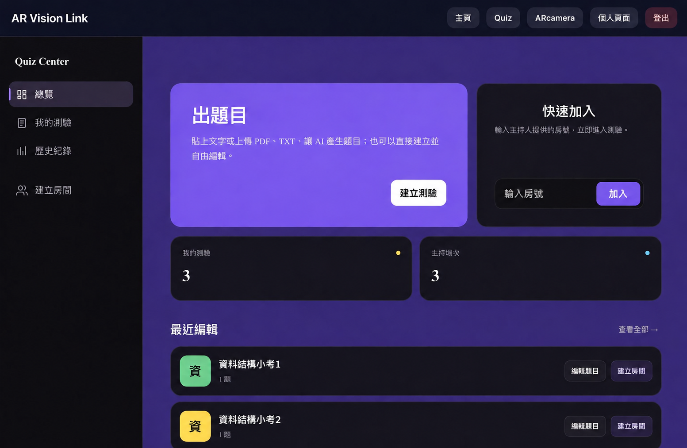
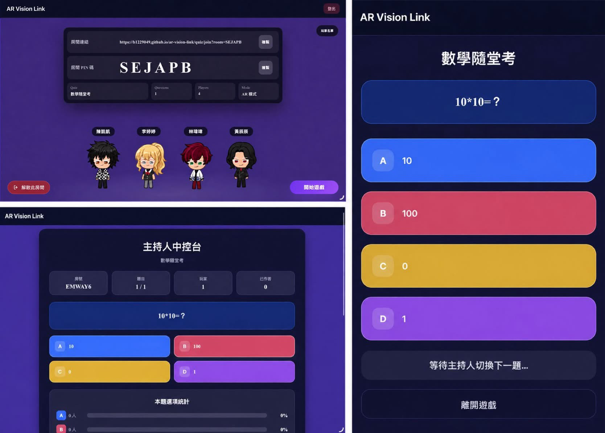
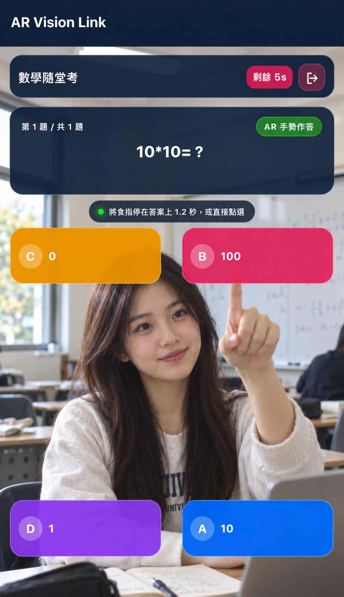
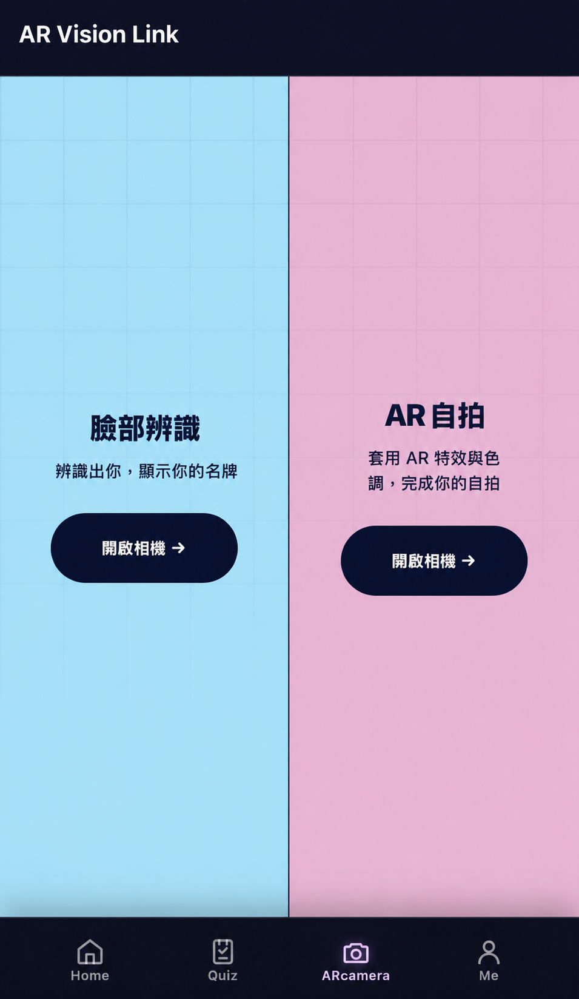
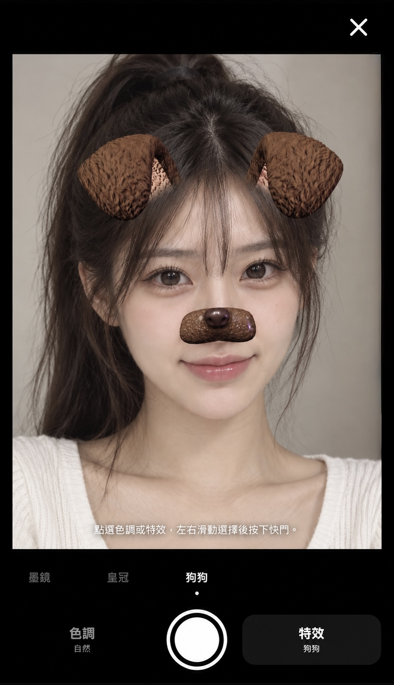
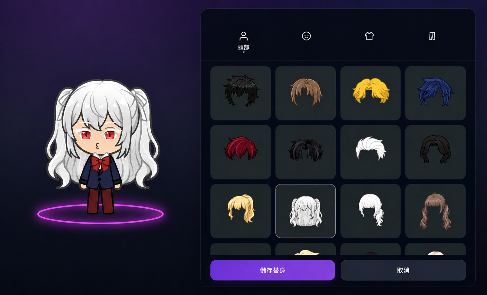
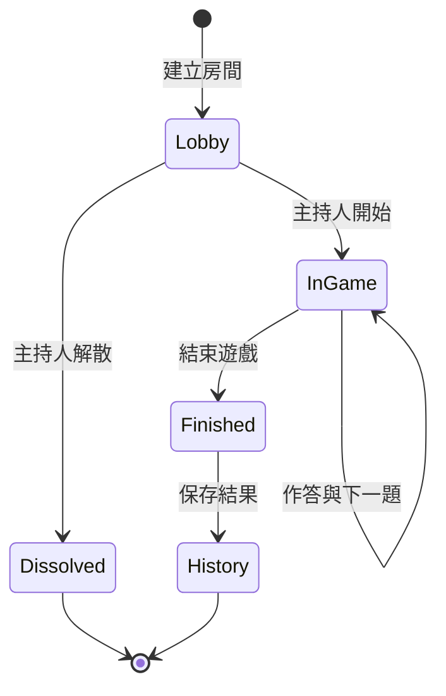
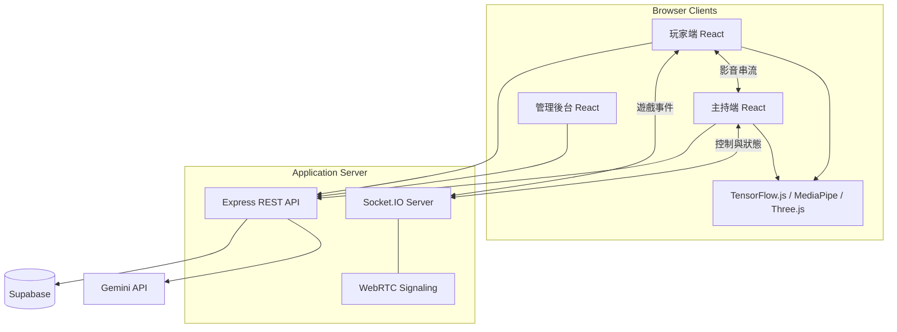

# AR Vision Link

<div >

**結合即時多人測驗、AR 互動、WebRTC 視訊與人臉辨識的線上學習平台**

[](https://react.dev/)
[](https://vite.dev/)
[](https://nodejs.org/)
[](https://socket.io/)
[](https://supabase.com/)


</div>
專案網址：https://b1229049.github.io/ar-vision-link/
---

# 目錄

- [專案介紹](#專案介紹)
- [功能特色](#功能特色)
- [實機畫面](#實機畫面)
- [系統使用流程](#系統使用流程)
- [技術架構](#技術架構)
- [即時通訊設計](#即時通訊設計)
- [人臉辨識與 AR](#人臉辨識與-ar)
- [計分機制](#計分機制)
- [專案結構](#專案結構)
- [主要頁面](#主要頁面)

---

# 專案介紹

AR Vision Link 是一套以瀏覽器為核心的互動式測驗平台。系統將傳統選擇題遊戲與攝影機、即時視訊、人臉辨識及 AR 技術整合，讓主持人與玩家能在同一場線上活動中即時互動。

主持人可以建立或管理題庫、開設遊戲房間、控制題目進度並查看玩家影像；玩家則可以使用房號加入，選擇一般答題或 AR 手勢模式，並即時取得分數與排名。

平台也提供 AI 出題、虛擬替身、造型商城、QR Code 金幣獎勵、AR 自拍、測驗歷史與管理後台等延伸功能。

### 適用情境

- 課堂即時測驗與複習活動
- 校園成果展示或互動展覽
- 多人競賽與團體活動
- AR、人臉辨識及 WebRTC 技術展示
- 遠距教學中的互動回饋

---

# 功能特色

### 即時多人測驗

- 使用六碼房號建立與加入房間
- Lobby 即時顯示已加入玩家
- 主持人控制開始、換題、結束及解散房間
- 題目、倒數、作答結果與排行榜即時同步
- 玩家離線與短時間重新連線處理
- 支援一般模式、AR 模式及加入時選擇模式

### Quiz Center

- 建立、瀏覽、編輯與刪除題庫
- 每題支援四個選項、正確答案與作答時間
- 顯示已建立測驗及主持紀錄
- 查看玩家或主持人的歷史場次
- 顯示單場題目、答案與得分明細

### AI 題目生成

- 輸入文字內容產生四選一題目
- 上傳 PDF 並將內容整理為題庫
- 可設定產生題數與難度
- 自動檢查題目、選項與答案格式
- 產生後仍可人工修改再建立題庫

### WebRTC 玩家影像

- 玩家攝影機串流至主持人控制台
- Socket.IO 負責 WebRTC signaling
- 支援 STUN 與 TURN 連線設定
- 主持人可同時查看多位玩家影像
- 玩家斷線時自動清除對應的 Peer Connection

### 人臉辨識

- 註冊時擷取臉部特徵向量
- 透過歐氏距離進行登入比對
- 支援重新註冊臉部資料
- 可在相機畫面辨識多位已註冊使用者
- TensorFlow.js 支援 WebGL、WASM 與 CPU 後端降級

### AR Quiz

- 使用 MediaPipe 追蹤手部關鍵點
- 透過手勢選擇答案
- 在攝影機畫面疊加題目與作答介面
- 即時顯示個人分數與排行榜
- 與一般遊戲模式共用相同房間狀態

### AR 自拍

- 即時追蹤臉部 landmarks 與表情資訊
- 支援眼鏡、動物造型等效果
- 支援 2D Canvas 特效
- 使用 Three.js 載入及呈現 3D 配件
- 可依臉部位置、角度及比例調整特效

### 虛擬替身與換裝

- 所有user均擁有自己的虛擬替身
- 虛擬替身包含髮型、表情、上衣及下身分層組合
- 可透過不同造型打造自己的虛擬替身

### 管理後台

- 查看使用者數量及系統資源概況
- 管理使用者狀態與管理員權限
- 檢視測驗、場次、作答及視覺紀錄
- 編輯或刪除允許管理的資料內容
- 建立並追蹤限時金幣獎勵

---

# 實機畫面

### Quiz Center

題庫建立、題庫管理與歷史紀錄集中在同一個控制中心。

<div align="center">
  
</div>

### 遊戲畫面

玩家作答與主持人控制台即時同步，完整呈現從 Lobby 到即時答題的遊戲流程。

<div align="center">
  
</div>

### AR Quiz

展示手勢辨識、相機背景、答案區域與即時回饋。

<div align="center">
  
</div>

### AR 自拍

可將多種 2D 與 3D 濾鏡整理成一張橫向展示圖。

<div align="center">
  
  
</div>

### 虛擬替身換裝

展示角色預覽、分類選擇與不同完成造型。

<div align="center">
  
</div>

---

# 系統使用流程

### 主持人流程

```text
登入
  ↓
建立或選擇題庫
  ↓
建立遊戲房間並取得房號
  ↓
等待玩家加入 Lobby
  ↓
開始遊戲並控制換題
  ↓
查看即時作答、玩家影像與排行榜
  ↓
結束遊戲並查看歷史紀錄
```

### 玩家流程

```text
人臉登入
  ↓
輸入或掃描房號
  ↓
加入 Lobby 並選擇遊戲模式
  ↓
使用按鈕或 AR 手勢作答
  ↓
查看單題結果與即時排名
  ↓
遊戲結束後查看排行榜
```

### 遊戲狀態



---

# 技術架構



### 技術堆疊

| 層級 | 技術 | 用途 |
| --- | --- | --- |
| 前端 | React 19 | 元件化使用者介面與狀態管理 |
| 路由 | React Router 7 | 公開頁面、保護頁面與巢狀 Quiz Center |
| 建置 | Vite 8 | 前端建置與靜態資源處理 |
| 後端 | Node.js、Express 4 | REST API、遊戲邏輯及檔案上傳 |
| 即時同步 | Socket.IO 4 | 房間、題目、答案與排行榜事件 |
| 視訊 | WebRTC | 玩家攝影機至主持人的影音串流 |
| 雲端服務 | Supabase | 使用者、題庫、場次及歷史資料 |
| AI | Google Gen AI SDK、Gemini | 文字與 PDF 題目生成 |
| 人臉辨識 | face-api、TensorFlow.js | 人臉偵測、特徵擷取與比對 |
| AR 追蹤 | MediaPipe Tasks Vision | 臉部及手部關鍵點追蹤 |
| 3D | Three.js | 3D AR 模型載入與渲染 |
| QR Code | ZXing、qrcode | QR Code 掃描與產生 |

### 前後端職責

- **React 前端**：處理畫面、攝影機權限、AR 推論、作答操作與虛擬角色呈現。
- **Express API**：處理使用者、測驗、遊戲、作答、歷史、商城、獎勵及管理功能。
- **Socket.IO**：維持多人房間狀態並推送所有即時遊戲事件。
- **WebRTC**：負責玩家與主持人之間的影音傳輸。
- **Supabase**：保存跨裝置及跨場次需要持續存在的資料。
- **Gemini**：將文字或 PDF 教材轉換成結構化選擇題。

---

# 即時通訊設計

### 遊戲事件

| 事件 | 方向 | 說明 |
| --- | --- | --- |
| `join-session` | Client → Server | 加入指定遊戲房間 |
| `session-sync` | Server → Client | 傳回房間、題庫與排行榜完整狀態 |
| `player-joined` | Server → Room | 通知新玩家加入 |
| `player-left` | Server → Room | 通知玩家離開 Lobby |
| `game-started` | Server → Room | 遊戲開始 |
| `question-changed` | Server → Room | 切換至下一題 |
| `answer-submitted` | Server → Room | 玩家已完成作答 |
| `player-result-updated` | Server → Room | 推送正確性與得分結果 |
| `leaderboard-updated` | Server → Room | 推送最新排行榜 |
| `game-finished` | Server → Room | 遊戲結束及最終排行 |
| `room-dissolved` | Server → Room | Lobby 已被主持人解散 |

### WebRTC signaling 事件

| 事件 | 用途 |
| --- | --- |
| `webrtc-host-ready` | 主持端通知玩家可建立連線 |
| `webrtc-player-ready` | 玩家端通知主持端已準備完成 |
| `webrtc-offer` | 傳遞 SDP offer |
| `webrtc-answer` | 傳遞 SDP answer |
| `webrtc-ice-candidate` | 交換 ICE candidate |
| `webrtc-user-disconnected` | 清除離線使用者的影音連線 |

---

# 人臉辨識與 AR

### 人臉登入流程

```text
取得攝影機畫面
  ↓
偵測單一人臉與 68 個 landmarks
  ↓
產生臉部 descriptor
  ↓
與已註冊特徵計算歐氏距離
  ↓
選擇距離最小且通過門檻的使用者
```

### 推論後端降級

系統會優先嘗試使用 WebGL。若裝置不支援或初始化失敗，會切換至 WASM，最後再使用 CPU，讓不同裝置仍能使用基本的人臉功能。

```text
WebGL → WASM → CPU
```

### AR 處理方式

- MediaPipe Face Landmarker 提供臉部關鍵點與表情資訊。
- MediaPipe Hand Landmarker 提供手部關鍵點，供 AR Quiz 判斷手勢。
- Canvas 2D 負責繪製眼鏡、皇冠及動物造型等平面特效。
- Three.js 負責載入 GLTF 與自訂幾何模型並對齊臉部位置。
- 特效尺寸與旋轉會依眼距、臉部角度及畫面尺寸動態更新。

---

## 計分機制

每題得分由正確性與剩餘時間共同決定：

```text
答對：1000 + max(剩餘秒數, 0) × 10
答錯：0
總分：同一場次所有題目得分總和
```

作答完成後，伺服器會更新玩家累積分數，並向房間內所有使用者推送個人結果與最新排行榜。

---

# 專案結構

```text
ar-vision-link/
├─ backend/
│  ├─ server.js                  # REST API、遊戲邏輯、Socket.IO、WebRTC signaling
│  ├─ admin-server.js            # 管理後台與獎勵 API
│  └─ package.json               # 後端相依套件與啟動設定
├─ public/
│  ├─ ar-assets/                 # 3D AR 模型、材質與授權資訊
│  ├─ avatar-assets/             # 基本虛擬角色圖層
│  ├─ store/                     # 商城套裝圖層
│  ├─ generated/                 # 產品與角色展示素材
│  └─ tfjs-backend-*.wasm        # TensorFlow.js WASM 執行檔
├─ src/
│  ├─ assets/                    # 前端靜態圖片
│  ├─ components/                # 共用元件、路由守衛、角色及視訊元件
│  ├─ data/                      # 商城商品目錄
│  ├─ pages/                     # 功能頁面
│  ├─ styles/                    # 頁面及元件樣式
│  ├─ utils/                     # AR、角色設定與圖片合成工具
│  ├─ App.jsx                    # 應用路由
│  └─ main.jsx                   # React 進入點
├─ test/                         # 早期版本的獨立應用副本
├─ avatar-group-composer.html    # 角色圖層合成校正工具
├─ avatar-relative-calibrator.html
├─ store-outfit-calibrator.html  # 商城套裝校正工具
├─ index.html
├─ vite.config.js
└─ package.json
```

---

# 主要頁面

| 分類 | 頁面 | 說明 |
| --- | --- | --- |
| 首頁 | `Home` | 登入狀態、功能入口、掃描房間與獎勵 |
| 帳號 | `Register`、`FaceLogin` | 人臉註冊與登入 |
| 個人資料 | `Profile`、`EditProfile` | 個人資料顯示與修改 |
| 相機 | `CameraHub`、`Camera` | 相機功能入口與多人臉部辨識 |
| Quiz Center | `QuizHome` | 測驗功能儀表板 |
| 題庫 | `CreateQuiz`、`ManageQuizzes` | 題庫建立、AI 出題與管理 |
| 加入遊戲 | `JoinQuiz` | 輸入房號、選擇模式與 Lobby |
| 主持遊戲 | `HostLobby`、`HostConsole` | 建立房間及控制遊戲 |
| 玩家遊戲 | `QuizGame`、`ARQuizGame` | 一般模式與 AR 模式答題 |
| 結果 | `Leaderboard`、`QuizHistory` | 排行榜與歷史明細 |
| AR 自拍 | `ARSelfie` | 2D／3D 臉部特效 |
| 虛擬替身 | `AvatarDressup` | 角色換裝與儲存 |
| 商城 | `Store` | 套裝瀏覽與購買 |
| 素材管理 | `AvatarAdmin` | 角色圖層參數校正 |
| 系統管理 | `Admin` | 系統資料與獎勵管理 |

---
# 相關文件

本專案的相關文件皆存放於 [`doc/`](./doc/) 資料夾底下，歡迎查閱：
- 三上期末報告書
- 需求規格書
- 設計文件書(包含詳細流程圖、使用案例圖、活動圖)
- 第1次上台簡報
- 第2次上台簡報

---

# 報告影片 & 專題demo

- 第2次上台簡報_錄影 (位於主目錄下方 .mp4 檔)

---
